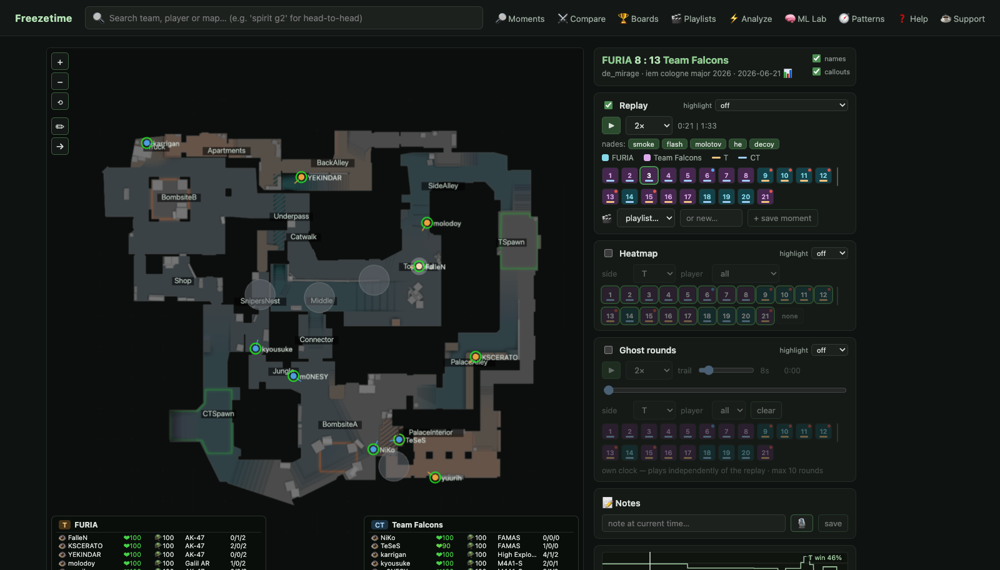

# Freezetime — CS2 Analysis Platform

[](LICENSE)
[](CONTRIBUTING.md)
[](https://claude.com/claude-code)

Self-hosted, coach-grade analysis for **Counter-Strike 2** demos. Every demo is
parsed **once** into positions (16 Hz), kills, grenades and economy; from that,
hundreds of features are pre-computed into database tables. After that, every
question — *"what does this team run on a full buy after losing a round on A?"* —
is a fast lookup, not a re-watch. The motto is **parse once, query forever.**

Everything runs on your own machine. There are **no external AI services** and
no per-use cost: all the "smart" parts are deterministic statistics, geometry,
and models trained locally on your own archive.

MIT licensed — free to use, modify and share. The UI is in English; some
internal docs (`docs/mimari.md`) and code comments are in Turkish.

🤖 Built end to end with [Claude Code](https://claude.com/claude-code)
(Claude Fable 5) — from the Rust parser to the React UI.

> 💬 **Why it's free:** I was going to launch this as a subscription website and
> try to make some money selling monthly plans. But — what the hell. It's more
> fun to just put it out there. Use it, learn from it, build on it. If it helps
> your team, that's payment enough. If you like it, a ⭐ makes my day —
> and if it *really* helps, you can [buy me a coffee](https://ko-fi.com/bengin) ☕.

---

## Two ways to use Freezetime

**1. 🌐 Browse the public archive — nothing to install.** A free, read-only
copy of the site with a curated pro-match archive is published on GitHub Pages:

> **https://benginn.github.io/csfreezetime** — 2D replays, opponent reports,
> predictions, ML Lab and leaderboards, straight from your browser.

**2. 🖥 Self-host the full studio.** The public site is a *static snapshot*; the
live-query features below need the real databases running. For those — or to
build an archive from **your own demos** — download this repository and run it
on your own machine ([step-by-step setup](#step-by-step-setup-from-zero)).

| Feature | Public site | Self-hosted |
|---|:---:|:---:|
| 2D replay, match heatmaps, ghost rounds | ✅ | ✅ |
| Opponent reports, predictions, ML Lab, leaderboards, compare | ✅ | ✅ |
| Search (teams / players / tournaments / matches) | ✅ | ✅ |
| **Analyze your own demo** (parsed in-browser, never uploaded) | ✅ | ✅ |
| **My DB** — your own private demo database, with local team reports | ✅ | ✅ |
| **Veto simulator** (computed in-browser on the public site) | ✅ | ✅ |
| **Notes & playlists** (stored in your browser, export/import as a file) | ✅ | ✅ |
| **Moments** — structured event search (kills, grenades, bombs, economy) | ✅ per map | ✅ |
| Presence queries (players in an area), Pattern Finder, Scenarios | — | ✅ |
| Free-range heatmap time windows, cross-match round overlay | — | ✅ |
| **Feeding it your own demos** | — | ✅ |

### If you just want to use the site (visitors)

Nothing to install, no account:

1. Open **https://benginn.github.io/csfreezetime**.
2. Pick a match from the home page (search by team, player or tournament).
   The first time you open a match its replay bundle (a few MB) downloads and
   is cached by your browser — after that it works instantly, even offline.
3. Watch the **2D replay** (play/pause, speeds, kill feed, grenade arcs),
   switch tabs for **heatmaps** and **ghost rounds**.
4. Dig into a team via **⚔ Compare**, the **opponent report** (the 📊 link on
   a team), **🏆 Boards** and the **🧠 ML Lab**.
5. Got a demo of your own? **⚡ Analyze** parses it right in your browser —
   nothing is uploaded anywhere — and shows it as a full match page.
6. **🔎 Moments** searches the archive for structured events (opening kills,
   early flashes, B plants, eco rounds…) right in your browser — pick a map
   first. A few of the heaviest features (presence queries, Pattern Finder,
   Scenarios, custom heatmap time windows) are marked **self-host only** —
   for those, run the studio yourself (next section).

The archive is updated in batches (roughly weekly) by the maintainer.

> **Your own demos?** The ⚡ **Analyze** page parses a single demo **inside
> your browser** (WebAssembly — the file never leaves your machine) and opens
> it as a normal match page. For a whole *archive* of your own demos (scrims,
> a private team database with reports and predictions), self-host: drop demos
> into `backfill/`, or use **My DB** to keep them separate. Next section.

### If you want to run it yourself (self-hosting)

Clone this repo and follow **[Step-by-step setup](#step-by-step-setup-from-zero)**.
You get every feature, and the archive is whatever **you** feed it:

> ⚠️ **You bring the demos.** The repo ships the *engine*, not any match data —
> no demos, no database dumps. Drop your own `.dem` files into `backfill/` and
> it builds your archive (see [Feeding it demos](#feeding-it-demos)).
> Everything is local and private. You can even publish your own static copy
> of your archive (see [Publishing a static copy](#publishing-a-static-copy-github-pages)).

📖 Prefer a narrative tour? See **[docs/how-it-works.md](docs/how-it-works.md)**.

---

## See it in action

▶️ **[Watch the walkthrough on YouTube](https://www.youtube.com/watch?v=15j45llHpd4)** —
a tour of the 2D replay, opponent reports, Pattern Finder, Scenarios and more.

[](https://www.youtube.com/watch?v=15j45llHpd4)

<!-- SCREENSHOTS (optional): drop PNGs in docs/screenshots/ and embed them here,
     e.g.  -->

---

## What you can do

Once you've fed it some demos, the web app (`http://localhost:8090`) gives you:

### The match page — one map, three layers

- **2D replay.** A synchronized top-down view of any round. Player dots show
  facing direction, an HP ring, and a corner HUD with shield / money / inventory
  plus a live kill feed. Blinded players whiten and fade back as the flash wears
  off; muzzle flashes and red tracers show who is shooting whom. Play/pause,
  speeds 0.25×–8×, a timeline marked with kills and events, zoom/pan, and a
  drawing tool (pen + arrows, saved per round).
  - **Grenades:** trajectories are drawn; hover an active grenade for its type,
    throw time and thrower, plus its flight arc. Toggle grenade types on/off
    (hide HE/decoy to read smokes and flashes cleanly).
  - **Bomb & dropped weapons:** the C4 carrier wears a red dot; dropped weapons
    stay on the map with their name on hover.
  - **Focus & hide:** click a player to focus the timeline on their
    kills/deaths/nades, or hide players from the map with the eye button.
    **`setpos`** copies their exact position and view angles as a console
    command for your practice server.
  - **Round chips** are colored by winner with a side stripe; the **highlight**
    picker rings rounds by buy type, by strategy, or by "who had an AWP." Chips
    also flag **thrown rounds** (a team that peaked ≥75% win probability and
    still lost) and **surprise rounds** (a strategy the model gave <15%).
  - **Win probability** sparkline above the timeline, computed from archive
    history (alive counts, bomb state, clock).
- **Heatmap.** Football-style position density for any set of rounds you pick,
  one side or both, one player or everyone. Lower levels (Nuke) render in an
  inset.
- **Ghost rounds.** Overlay many rounds as translucent trails on their own
  clock — align at round start, bomb plant, or first kill to compare executions.
  Trail length slider; hover/pin a ghost for that player's live HP/economy.
- **Notes & playlists.** Pin text or voice notes to the exact second of a round;
  save moments into named playlists that **auto-advance** for hands-free review.

### Team intelligence

- **Team page.** Overall record, per-map cards with each side's signature
  strategy (vs the league average), a **player table** (matches, rounds, ADR,
  K/D, flash assists, survival) with current-five vs former players marked, and
  the match list. A free-form **time window** and a **lineup ≥ N/5** filter
  narrow everything.
- **Opponent report** (`/report/:team`) — the coach's one-pager per team & map:
  - **Overview:** map record, side round-win rates, pistols, conversion after a
    won pistol, **rush rate**, and **set-strat share** (rehearsed executes vs
    default/mid-round).
  - **Execute templates:** utility combinations they repeat to open a site.
  - **Strategy tendencies:** what they favor, with a **×N vs league** badge; a
    **by-buy** table and a **by-round-type** table (pistol / after pistol / 3rd /
    mid-game / overtime).
  - **Next-round prediction:** the same engine as the ML Lab, with the method
    and evidence shown.
  - **Default setups:** exact player positions 15 s in, with a **site notation**
    (3A-2B), hold times, and how they rotate after first contact.
  - **Utility habits, boosts, and map-control → outcome** ("when they take
    MainHall the round ends on A ×2.0").
  - **Thrown rounds** and a **player** breakdown (roles, opening duels,
    clutches, trades). Everything respects the window/lineup filters and prints
    cleanly.
- **Compare & veto.** Two reports side by side; a veto simulator that produces
  rational ban/pick sequences for BO1/BO3/BO5 from both teams' map strengths.

### Pattern Finder (`/patterns`)

Every grenade on a map, with the **top repeated landing spots** ranked for you
("smoke → TopMid ×47, usually at 1:39 ±5s"). Drag a box on the map to isolate an
area, read the timing histogram, filter by team/side/player/period/type, and
jump into the rounds.

### Scenarios (`/scenarios`)

Situation queries about a team: *"as T on Mirage, full buy, right after losing a
round on A — what do they run?"* You get the historical mix in exactly that
spot, how far it deviates from their normal game (**×N vs usual**), and real
rounds to watch.

### ML Lab (`/insights`)

The transparency page for the prediction models: pick a team and see what the
site would predict, watch six methods (from a league baseline to a **LightGBM**
model) race on a **temporal test**, and see which one wins per map & side —
because **only the winner is ever served.** Includes a strategy-cluster explorer
and, where the learned model wins, what drives its decisions.

### Players, leaderboards, moments

- **Player pages** are **map-driven**: pick a map and the role cards, clutches
  and heatmaps all focus on it. Roles (entry / lurker / anchor / AWP) come with
  evidence; the positioning heatmap has an **AWP-only** filter.
- **Leaderboards:** archive-wide top-20s (ADR, opening duels, clutches, flashes,
  trades), each stating its minimum sample.
- **Moments:** a structured search over every round ever parsed
  ("AWP kills through smoke on eco"), with presets and savable searches.

### My DB — your own private demos

Process private demos (scrims, FACEIT, POV) in your browser without touching the
main archive; the server never keeps a copy. You can **compose** your database
with matches pulled from the public archive, and attach **team voice comms**
that play synced to the replay. *(Self-hosting? You usually just backfill demos
into your own archive instead — it's your server. See below.)*

Numbers are **honest**: every claim carries its sample size, and thin data hides
itself rather than guess. 🧠 marks anything derived from the ML pipeline.

---

## Step-by-step setup (from zero)

Follow these in order. Everything runs on your own machine.

**0. Install the prerequisites** (once). Freezetime is built from several
languages, so a handful of tools must exist on your machine first. You don't
need to know any of them — just install and move on:

| Tool | What it's for here |
|---|---|
| **Docker** (+Compose) | runs the four databases in containers |
| **Rust** (`cargo`) + `protoc` | builds the demo parser |
| **Go** 1.22+ | builds the query/API service |
| **Node** 18+ | builds the web UI |
| **Python** 3.11+ + [`uv`](https://docs.astral.sh/uv/) | runs the stats/ML jobs |
| `unar` *(optional)* | rescues the occasional broken `.rar` from HLTV |

**macOS** — install [Homebrew](https://brew.sh) if you don't have it, then
copy-paste:

```bash
brew install --cask docker        # or: brew install colima docker docker-compose
brew install rustup protobuf go node uv unar
rustup-init -y                    # one-time Rust setup; then reopen the terminal
```

**Ubuntu/Debian** — roughly:

```bash
sudo apt install docker.io docker-compose-v2 protobuf-compiler golang nodejs npm unar
curl --proto '=https' --tlsv1.2 -sSf https://sh.rustup.rs | sh   # Rust
curl -LsSf https://astral.sh/uv/install.sh | sh                  # uv
```

**Check everything landed** (each line should print a version, not an error):

```bash
docker --version && cargo --version && protoc --version \
  && go version && node --version && uv --version
```

> Using Docker Desktop on macOS? Just open it once so the whale icon appears.
> Using colima instead? `colima start --cpu 4 --memory 8` first.

Then clone the repo and `cd` into it:

```bash
git clone https://github.com/benginN/csfreezetime.git && cd csfreezetime
```

**1. Start the databases and message queue.** This brings up PostgreSQL,
ClickHouse, MinIO and NATS in Docker, then creates the database tables:

```bash
cd infra && cp .env.example .env && docker compose up -d --wait postgres clickhouse minio nats
docker compose up -d minio-init && cd ..
scripts/apply-pg-schema.sh && scripts/apply-ch-schema.sh
```

**2. Start the four services.** Open **four terminals**, and in each one first
load the env vars with `set -a; source infra/.env; set +a`, then run one of:

```bash
# terminal 1 — parser (turns demos into data)
cargo run --release --manifest-path services/parser-worker/Cargo.toml

# terminal 2 — a second parser is optional but speeds up big batches
cargo run --release --manifest-path services/parser-worker/Cargo.toml

# terminal 3 — enrichment (trades, first-kills, buy classes…)
(cd services/enrichment && uv run --no-editable enrichment-worker)

# terminal 4 — stats-svc: the API + website on http://localhost:8090
(cd services/stats-svc && go build -o stats-svc . ) && ./services/stats-svc/stats-svc
```

**3. Build the website** (stats-svc serves it from `apps/web/dist`):

```bash
(cd apps/web && npm install && npm run build)
```

**4. Add demos** — see [Feeding it demos](#feeding-it-demos) below. This is what
actually fills the site with data.

**5. Open** <http://localhost:8090>. That's it.

> **macOS + Colima shortcut:** once set up, `scripts/start-all.sh` brings the VM,
> databases and all four services up in one command; `scripts/stop-all.sh` takes
> them down.

> **Sanity checks (optional):** `scripts/e2e-test.sh` (pipeline end-to-end),
> `scripts/test-dsl.sh` (replay/heatmap), `scripts/test-ml.sh` (analysis
> consistency).

---

## Feeding it demos

This is the important part — **the app is empty until you give it demos.**

**Step 1 — find (or create) the `backfill/` folder.** It lives at the **root of
the repo**, right next to `README.md`, `services/`, `apps/`. If it isn't there
yet, just make it:

```bash
mkdir -p backfill      # run this from the repo root
```

**Step 2 — drop your demo files into `backfill/`.** With the services running
(step 2 of setup), a watcher checks that folder **every ~20 seconds**, and for
each new file it: parses it → enriches it → adds it to your archive →
recomputes the analysis tables. **No button to press.** A file is only picked up
once its size stops changing between two scans, so a still-copying file safely
waits its turn.

**What you can drop in `backfill/`:**

- raw `.dem` files
- archives that contain demos: `.rar` or `.zip` (as you'd download from HLTV/FACEIT)
- compressed single demos: `.dem.gz` or `.dem.zst`

**Step 3 — wait, then refresh the site.** Parsing a demo takes seconds to a
minute or two depending on its size. As demos finish, the match total on the
home page goes up. Team-level analysis (tendencies, predictions, patterns) is
recomputed automatically once the queue settles.

**How much do you need?** Team-level intelligence only gets meaningful with a
real archive — the more demos, the sharper and more trustworthy the numbers. A
season or two of a team's matches is the sweet spot. Just want to look at **one
match**? The **Analyze** page parses a single demo on its own, no archive
required.

**Where to get demos:** your own GOTV recordings, FACEIT/ESEA downloads, or
HLTV. Respect each source's terms — Freezetime doesn't scrape anything; you
supply the files.

### Demos not showing up? (troubleshooting)

Work down this list — it's almost always one of these:

1. **Does the `backfill/` folder exist and contain your files?** It's at the
   repo root. Create it with `mkdir -p backfill` if missing.
2. **Are all the services running?** You need **stats-svc** (the watcher lives
   here), at least one **parser-worker**, and **enrichment** — all up, all
   started with the env loaded (`set -a; source infra/.env; set +a`).
3. **Give it ~20 seconds** for the scan, plus parse time. Big demos take longer.
4. **Watch the stats-svc terminal.** It logs `backfill izleyici: N dosya bulundu`
   when it picks files up, and `backfill HATA …` if one fails.
5. **A `.rar` that won't open?** Some HLTV archives trip the built-in unpacker;
   installing `unar` lets Freezetime recover them automatically.
6. **A match stuck showing "parsing"?** The system re-queues orphaned jobs on
   its own within a few minutes; you can also re-run analysis manually with
   `(cd services/ml && uv run --no-editable ml-jobs)`.
7. **Stats look stale after adding demos?** They recompute automatically, but you
   can force it any time with the same `ml-jobs` command above.
8. **`No space left on device` in the logs?** The demos/positions filled the
   disk (or, on macOS + Colima, the VM disk). Free space or grow the VM.

> Manual alternatives to the watcher: `scripts/ingest-dir.sh` queues a whole
> folder at once, and the in-browser **My DB** page processes private demos
> client-side.

---

## Map backgrounds (radar images)

The repo **ships radar PNGs** for the current competitive pool in
`services/stats-svc/static/radars/`, so the 2D replay looks like the in-game
radar out of the box. (They originate from the CS2 game files and are **Valve's
property** — included here purely so a non-commercial, free fan project works on
first clone. If Valve ever objects, they'll be removed; open an issue if you
represent the rights holder.)

Missing or new maps degrade gracefully: the replay falls back to a
**walkable-area silhouette** derived from position data. To add a map yourself:

- one **1024×1024** PNG named exactly after the map (`de_train.png`), dropped
  into `services/stats-svc/static/radars/`;
- two-level maps (Nuke, Vertigo) also take `de_<map>_lower.png` for the inset;
- **SVG works too** and stays crisp at any zoom (`de_mirage.svg` is tried before
  the PNG). Refresh the page, done — no restart needed.

---

## Publishing a static copy (GitHub Pages)

The public archive site is not hosted on a server — it's a **static snapshot**
of a self-hosted studio, published to GitHub for free. The pipeline:

1. `services/stats-svc/cmd/export` walks the running API and writes every page
   as a JSON file, plus one gzipped **replay bundle** per match (a few MB each).
2. Page JSONs and the web app are pushed to this repo's **`gh-pages` branch**
   (served by GitHub Pages); match bundles go to **Cloudflare R2** (pennies per
   month — GitHub Releases can't serve browser `fetch()` requests, their
   downloads carry no CORS headers). The site downloads a match's bundle on
   first view and caches it in the browser.
3. `scripts/publish.sh` does all of the above in one command, **incrementally**
   — already-published matches are never re-exported, and an interrupted run
   resumes where it left off.

Fork-friendly: set `FREEZETIME_SITE_REPO=you/yourrepo` (the URL base is derived
from the repo name automatically), put your R2 credentials in `infra/.env`
(`R2_ENDPOINT`, `R2_ACCESS_KEY_ID`, `R2_SECRET_ACCESS_KEY`, `R2_BUCKET`,
`R2_PUBLIC_BASE` — and add a CORS policy allowing your site's origin in the
R2 dashboard), run `scripts/publish.sh`, then enable Pages once
(Settings → Pages → deploy from branch `gh-pages`). Without R2 credentials
bundles fall back to GitHub Releases, which works for `curl` but **not** for
the in-browser replay.

> ### 📝 Maintainer note — the weekly routine (one command)
>
> 1. Plug in the archive SSD, open a terminal in the repo and run
>    **`scripts/weekly.sh`** (add `--shutdown` to power everything down at
>    the end). It brings the platform up and waits for you.
> 2. Drop the week's demo archives (`.rar`/`.zip` from HLTV) into
>    `backfill/` and press ENTER. **Download first, then feed** — never
>    point the download manager straight at `backfill/`; half-written
>    files get picked up broken. Big batch? Let downloads finish before
>    feeding (an external SSD throttles under simultaneous write load).
> 3. The script does the rest: waits for processing and the stats refresh,
>    publishes only the **new** matches to GitHub, then prints a five-line
>    **health check** (live-site match count, a real bundle download test,
>    ML freshness, failed delta, disk usage). If a file is stuck ~10 min it
>    warns you — that's usually a corrupt download: move it out of
>    `backfill/`, re-download, carry on.
> 4. Unplugging the SSD? `scripts/stop-all.sh` first, always (or use
>    `--shutdown`).
>
> ### 🧭 Maintainer note — where everything lives & disaster recovery
>
> - **Everything lives on the SSD** (`/Volumes/T7/cs2-freezetime/`):
>   `cs2-platform/` (this repo — open Claude Code HERE for help; it carries
>   the full project memory), `colima/` (the VM: PostgreSQL + ClickHouse +
>   MinIO with the raw-demo vault), `backfill/` (drop demos),
>   `downloads/` (download staging), `memory-backup/` (assistant memory,
>   auto-pushed to the private `freezetime-claudememoryforbackup` repo on
>   every commit).
> - **On GitHub:** code (`csfreezetime`), the live site + page data + replay
>   bundles (the code repo's `gh-pages` branch; replay bundles live in Cloudflare R2), assistant memory (private).
> - **If the SSD dies:** nothing irreplaceable is lost — code, the published
>   archive and the memory are on GitHub; raw demos re-download from HLTV.
> - **New machine / recovery:** clone the code repo, clone the private
>   memory repo and copy its `memory/` into
>   `~/.claude/projects/<sanitized-repo-path>/memory/`, then open Claude
>   Code in the repo — it picks up exactly where things left off.

---

## How it's built

| Directory | Language | Role |
|---|---|---|
| `services/parser-worker` | Rust | `demo.ingested` → download → parse → ClickHouse ticks + PostgreSQL meta |
| `services/enrichment` | Python | trades, first-kills, buy classes, first-grenade flags |
| `services/stats-svc` | Go | the query engine, heatmap/replay/stacking API, and it serves the web app (`:8090`) |
| `services/ml` | Python | local statistics: strategy clustering, tendencies, roles, predictions, anomalies (`uv run ml-jobs`) |
| `apps/web` | React + TS | the UI: matches, 2D replay (PixiJS), and every analysis page |
| `infra/` | — | docker-compose: PostgreSQL 16, ClickHouse, MinIO, NATS JetStream |
| `scripts/` | — | schema apply, bulk ingest, end-to-end tests |

**Why two databases:** ClickHouse holds the heavy per-tick position data
(millions of rows per match — great at "where was everyone at second 15 across
300 rounds"); PostgreSQL holds the relational meta and every pre-computed
analysis table the coach reads. Services talk over NATS JetStream; raw demos
live in MinIO (S3-compatible).

Every architectural decision is documented in **[docs/mimari.md](docs/mimari.md)**
(Turkish). New to the code? **[docs/how-it-works.md](docs/how-it-works.md)** is
the friendly tour and shows where to start reading.

---

## Built with Claude Code

This project was built end to end with, and is set up to be explored with,
[Claude Code](https://claude.com/claude-code) (Claude Fable 5). Clone it, open
Claude Code in the repo, and it reads `CLAUDE.md` (house rules) and
`docs/mimari.md` (architecture) — enough context to answer *"where is the
win-probability table built?"* or *"add a filter to the opponent report."* No
original author's notes required; everything a contributor needs is in the repo.

---

## Contributing &amp; community

- **Questions, setup help, ideas** → start a
  [Discussion](https://github.com/benginN/csfreezetime/discussions).
- **Found a bug or want a feature** → open an
  [Issue](https://github.com/benginN/csfreezetime/issues).
- **Want to build on it** → see [CONTRIBUTING.md](CONTRIBUTING.md); forks and
  pull requests are welcome. It pairs nicely with Claude Code.
- **Enjoying it?** A ⭐ helps other people find it.

## License

MIT — see [LICENSE](LICENSE). Use it, fork it, ship it; just keep the copyright
notice. No warranty.

Demo files are property of Valve / the tournament organizers and are **not**
included in this repository; supply your own. The bundled CS2 radar images are
Valve's property, included only so this free, non-commercial project works out
of the box (see [Map backgrounds](#map-backgrounds-radar-images)).

## TODO

- [ ] Add screenshots to the README (`docs/screenshots/`).
